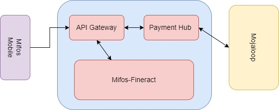
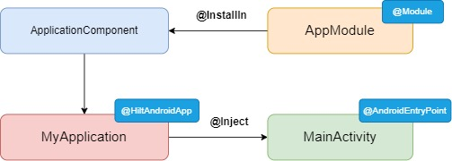
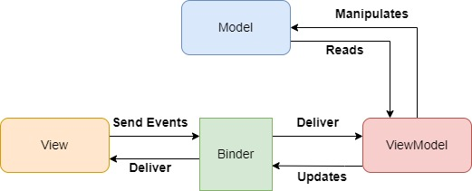

<p align='center'>
    
    <br><br><br>
    
    <br><br>
    <center><h1>GSOC'23 PROPOSAL - Mifos Initiative</h1></center>
    <center><h2><b>Mifos Mobile 6.0 - Mobile Banking App
</b></h2></center>
    <br><br><br>
</p>

Organization: [Mifos Initiative](https://mifos.org/)

Project Name: [Mifos Mobile 6.0 - Mobile Banking App](https://mifosforge.jira.com/wiki/spaces/RES/pages/3296690177/Google+Summer+of+Code+2023+Ideas#Mifos-Mobile-6.0---Mobile-Banking-App)

Candidate Name: [Pratyush Singh](https://github.com/PratyushSingh07)

Expected Project Size: 350 hours

Mentors: 
- [Ahmad Jawid Muhammadi](https://github.com/jawidMuhammadi) 
- [Garvit Agarwal](https://github.com/garvit984)
- [Saksham Handu](https://github.com/miPlodder)

<br><br><br><br><br><br><br><br>

# Contents     
1. [Project Idea](#1-project-idea)
2.  [Implementation Details ](#2-implementation-details)   
    2.1  [Integration with Mojaloop via payment hub](#21-integration-with-mojaloop-via-payment-hub)<br>
    2.2  [Migration from MVP to MVVM](#22-migration-from-mvp-to-mvvm)  <br>
    &nbsp;&nbsp; 2.2.1      [Migrating an activity](#221-migrating-an-activity) <br>
    &nbsp;&nbsp; 2.2.2  [Migrating a fragment](#222-migrating-a-fragment)<br>
    2.3  [Basic Integration of Navigation Graph](#23-basic-integration-of-navigation-graph)<br>
    2.4  [Migration from Dagger to Hilt](#24-migration-from-dagger-to-hilt)<br>
    2.5 [Basic integration of coroutines](#25-basic-integration-of-coroutines)<br>
    2.6 [Integration of rocket chat for customer support](#26-customer-support-via-rocket-chat)<br>
    2.7 [Unit tests for the data and UI layer](#27-unit-tests-for-data-and-ui-layer)<br>
    2.8 [Improving Github workflows](#28-improving-github-workflows)<br>
    2.9 [Integration of jetpack compose](#29-integration-of-jetpack-compose)<br>
    2.10 [My Ideas for the app](#210-my-ideas-for-the-app)<br>
       &nbsp;&nbsp;  2.10.1 [Use Fineract SDK](#2101-use-fineract-sdk)<br>
        &nbsp;&nbsp;  2.10.2  [Migrating from Butter Knife to View Binding](#2102-migrating-from-butter-knife-to-view-binding)<br>
        &nbsp;&nbsp;  2.10.3  [Adding option to change connection settings from login page](#2103-adding-option-to-change-connection-setting-from-login-page)<br>
3. [Contributions To Mifos](#3-contributions-to-mifos)
4. [Week Wise Breakdown](#4-week-wise-breakdown)<br>
    4.1  [Community Bonding Period (4 May - 28 May)](#41-community-bonding-period-4-may---28-may)<br>
    4.2  [Phase 1 (29 May - 9 July)](#42-phase-1-29-may---9-july)<br><!--  TODO along with the breakdown image -->
    4.3  [Phase 2 (14 July - 21 Aug)](#43-phase-2-14-july---21-aug)<br><!--  TODO along with the breakdown image -->
    4.4 [Post phase 2 (After Aug 28)](#44-post-phase-2-after-aug-28)
5.  [Why Am I The Right Person](#5-why-am-i-the-right-person)
6.  [Current Area of Study](#6-current-area-of-study)
7.  [Contact Information](#7-contact-information)
8.  [Career Goals](#8-career-goals)
9.  [My Projects](#9-my-projects)
10.  [Gitter Channel](#10-gitter-channel)
11.  [Other Open Source Contributions](#11-other-open-source-contributions)
12.  [Experience with Angular/Java/Spring/Hibernate/MySQL/Android](#12-experience-with-angularjavaspringhibernatemysqlandroid)
13.  [Other Commitments](#13-other-commitments)
14.  [What motivates me to work with mifos](#14-what-motivates-me-to-work-with-mifos-for-gsoc)
15.  [Previous Participation in GSoc](#15-previous-participation-in-gsoc)
16.  [Application to multiple Orgs](#16-application-to-multiple-orgs)
<br><br><br><br><br><br><br><br><br>


# **1. Project Idea**
I am enthralled with Mifos Mobile ideas list and I thus wish to contribute in this project

Abstract
- 

- One of the main objectives of this year's project is to replace the API layer from self-service Fineract APIs to Open Banking APIs. This will ensure that the project is up to date and compatible with the latest technology. Additionally, the project requires integration with an external payment system such as Mojaloop or mPesa through the payment hub.

- Another critical task is to migrate from Dagger to Hilt, which is a new, more efficient dependency injection library. Furthermore, the project needs to migrate from MVP to MVVM-Clean architecture to improve maintainability and scalability. Additionally, the Navigation Graph needs to be integrated into the project to enhance the user experience.Coroutines need to be integrated into the project to enable asynchronous programming and simplify concurrency management. Furthermore, unit tests need to be added for the Data Layer and UI Layer, while UI tests need to be added to cover all the screens and end the project with the integration of jetpack compose.

- Finally, the developer needs to improve the Github workflows and add jobs to run Unit and UI tests to ensure continuous integration and delivery. By completing these tasks, the project will be updated, efficient, and maintainable, improving its functionality and performance.
<br>

# **2. Implementation Details**

## **2.1 Integration with Mojaloop via payment hub**
- The Mifos Payment Hub can be used to connect to Mojaloop (payments switch) for inbound and outbound transactions by implementing Mojaloop API and mapping them to the Fineract API
- To my understanding we will Install Mifos's Payment Hub on a server or cloud platform & then configure the Payment Hub to use the Mojaloop API as the payment gateway. We can then integrate the payment hub with our mobile using the available APIs
- For testing purposes,the integration can be tested in a sandbox environment to ensure it is working as expected

     

## **2.2 Migration from MVP to MVVM**
- Currently in the MVP architecture the View and Presenter are tightly coupled, which can make it difficult to modify the code or reuse components. However with MVVM, the ViewModel serves as an intermediary between the View and Model, allowing for a **looser coupling** and greater **flexibility**
-  MVP can lead to code that is complex and difficult to maintain, especially when dealing with complex user interfaces. MVVM can simplify the code by separating the business logic from the UI components, making it easier to modify and maintain the codebase
- In MVP, managing the state of the View can be challenging, especially when dealing with configuration changes such as screen rotation. With MVVM, the ViewModel can maintain the state of the View, making it easier to manage and **avoid data loss**
- Furthermore,MVVM architecture can be combined with reactive programming libraries like RxJava, which can make it easier to handle **asynchronous data flows** and improve the application's **performance**

### **2.2.1 Migrating an Activity**
- In the original code, all the business logic was in the SplashActivity class. This violates the separation of concerns principle, which states that each class should have a **single responsibility**. In the MVVM architecture, the ViewModel is responsible for holding the data and the business logic, while the View (in this case, the SplashActivity) is responsible for displaying the data and handling user interactions.

- So, to follow this principle, we create a separate SplashViewModel class that holds the business logic, and move the logic from the SplashActivity to the SplashViewModel. This way, the SplashActivity is only responsible for displaying the data returned by the SplashViewModel, and the SplashViewModel is responsible for deciding what data to return and how to generate it.

- The SplashViewModelFactory is used to create an instance of the SplashViewModel. We use a Factory instead of directly creating a new instance of the ViewModel class because the ViewModel class has a lifecycle that is tied to the lifecycle of the View (i.e., the SplashActivity), and the Factory ensures that we always get the same instance of the ViewModel even if the View is recreated due to configuration changes like screen rotation. The Factory creates the ViewModel using the PasscodePreferencesHelper object as a constructor parameter, so that the ViewModel has access to the data it needs to generate the appropriate Intent.
Below is the code for <font color="#dd4124">SplashViewModel.kt</font>
<!-- -  -->
```js
class SplashViewModel(private val passcodePreferencesHelper: PasscodePreferencesHelper) : ViewModel() {
    var intent: Intent?=null
    val liveData : MutableLiveData<String> = MutableLiveData()
    fun getDestinationIntent() {
        CoroutineScope(Dispatchers.IO).launch{
            if (passcodePreferencesHelper.passCode.isNotEmpty()) {
                liveData.postValue("Yes")
            } else {
                liveData.postValue("No")
            }
        }
    }
}
```  
Below is the code for <font color="#dd4124">SplashViewModelFactory.kt</font>:
``` js
class SplashViewModelFactory(private val passcodePreferencesHelper: PasscodePreferencesHelper) : ViewModelProvider.Factory {
    override fun <T : ViewModel> create(modelClass: Class<T>): T {
        return SplashViewModel(passcodePreferencesHelper) as T
    }
}
```
Refactored code for <font color="#dd4124">SplashActivity.kt</font> :
```js
class SplashActivity : BaseActivity() {

    private lateinit var viewModel: SplashViewModel

    override fun onCreate(savedInstanceState: Bundle?) {
        super.onCreate(savedInstanceState)
        activityComponent?.inject(this)
        val passcodePreferencesHelper = PasscodePreferencesHelper(this)
        viewModel = ViewModelProvider(this, SplashViewModelFactory(passcodePreferencesHelper)).get(
            SplashViewModel::class.java)

        viewModel.getDestinationIntent()
        viewModel.liveData.observe(this){
            if (it.equals("Yes")){
                val i=(Intent(this,PassCodeActivity::class.java))
                i.putExtra(Constants.INTIAL_LOGIN,true)
                startActivity(i)
                finish()
            }
            else {
                startActivity(Intent(this,LoginActivity::class.java))
                finish()
            }
        }
    }
}
```
### **2.2.2 Migrating a fragment**
- I have converted the LocationsFragment from MVP to MVVM because the MVVM pattern separates the business logic from the view, making the code more modular and easier to test.In the MVP pattern, the presenter is responsible for handling the business logic and updating the view, which can lead to tight coupling between the view and the presenter. This can make the code harder to maintain and test.

- In the MVVM pattern, the view model is responsible for handling the business logic, while the view is responsible for displaying the data. This separation of concerns makes the code more modular and easier to test.To convert the LocationsFragment from MVP to MVVM, I removed any reference to the presenter and created a view model to handle the business logic.

- In the LocationsViewModel class, I created two methods to handle the logic previously handled by the presenter. These methods receive the GoogleMap instance as a parameter and use it to add a marker and animate the camera to the headquarter location. In the LocationsFragment, I removed the onCreateView() method from the MVP implementation and created a viewModel property that is initialized in the onCreateView() method. I also removed the addMarker() and addAnimationToHeadquarter() methods and called the corresponding methods in the viewModel instance from the onMapReady() method.

- Overall, the MVVM implementation is more modular and easier to test, as the business logic is separated from the view.<br>
Below is the <font color="#dd4124">LocationsViewModel.kt</font> :
``` js
class LocationsViewModel : ViewModel() {

    private val headquarterLatLng = LatLng(47.61115, -122.34481)

    fun addMarker(googleMap: GoogleMap) {
        googleMap.addMarker(
            MarkerOptions().position(headquarterLatLng)
            .title(context?.getString(R.string.mifos_initiative)))
    }

    fun addAnimationToHeadquarter(googleMap: GoogleMap) {
        googleMap.animateCamera(CameraUpdateFactory.newLatLngZoom(headquarterLatLng, 16.0f))
    }
}
```
Below is the modified <font color="#dd4124">LocationsFragment.kt</font> : 
```js
class LocationsFragment : BaseFragment(), OnMapReadyCallback {

    private lateinit var viewModel: LocationsViewModel

    @BindView(R.id.map)
    lateinit var mapView: MapView

    override fun onCreateView(inflater: LayoutInflater, container: ViewGroup?,
                              savedInstanceState: Bundle?): View? {
        val rootView = inflater.inflate(R.layout.fragment_locations, container, false)
        ButterKnife.bind(this, rootView)

        mapView.onCreate(savedInstanceState)
        mapView.onResume()

        try {
            MapsInitializer.initialize(requireContext())
        } catch (e: Exception) {
            Log.d(LocationsFragment::class.java.simpleName, e.toString())
        }

        mapView.getMapAsync(this)

        viewModel = ViewModelProvider(this).get(LocationsViewModel::class.java)

        return rootView
    }

    override fun onMapReady(googleMap: GoogleMap) {
        viewModel.addMarker(googleMap)
        viewModel.addAnimationToHeadquarter(googleMap)
    }
    companion object {
        fun newInstance(): LocationsFragment {
            return LocationsFragment()
        }
    }
}
```
# **2.3 Basic Integration of Navigation Graph**
- There aren't any navigation graphs in the project yet hence all navigation logic between different screens and activities are handled manually making the project more complex and error-prone code, which can slow down the app and make it more difficult to maintain.As the app grows in complexity, it can become increasingly difficult to manage the navigation logic manually. This can make it challenging to add new features or modify existing ones, which can limit the app's ability to scale and evolve over time.
- With navigation graph in place can improve user experience by allowing users to easily navigate between screens and tasks .Besides it provides a simplified and standardized approach to app navigation, making it easier for developers to build and maintain complex apps. It also helps to reduce the amount of code required to handle navigation, which can save development time and effort.
- The **Navigation Component** in Android provides a framework for implementing navigation between screens in an application. It uses a Navigation Graph, which is an XML file that defines the navigation paths and destinations in an app.The first step in integrating the Navigation Graph is to create the graph file and define the navigation paths and destinations. This can be done using Android Studio's Navigation Editor, which provides a visual interface for designing the graph.
- Once the Navigation Graph is created, the next step is to integrate it into the app's code. This involves using the Navigation Component APIs to load and navigate to the appropriate destination based on user input.
- As an example , I have taken up **SettingsFragment** and **UpdatePasswordFragment** . To implement a navigation graph I have added these two files in the xml and defined an action from SettingsFragment to the UpdatePasswordFragment.Having done this, I added a **FragmentContainerView** in the SettingsActivity that will act as my NavHost.
- The appropriate changes in <font color="#dd4124">activity_settings.xml</font> is : 
```xml
 <androidx.fragment.app.FragmentContainerView
            android:id="@+id/fragmentContainerView"
            android:name="androidx.navigation.fragment.NavHostFragment"
            android:layout_width="match_parent"
            android:layout_height="match_parent"
            app:defaultNavHost="true"
            app:layout_constraintBottom_toBottomOf="parent"
            app:layout_constraintEnd_toEndOf="parent"
            app:layout_constraintHorizontal_bias="0.0"
            app:layout_constraintStart_toStartOf="parent"
            app:layout_constraintTop_toTopOf="parent"
            app:layout_constraintVertical_bias="0.0"
            app:navGraph="@navigation/nav_frags" />
```
- Now we do not need the below code in **SettingsActivity**<span>
 ``` js 
replaceFragment(SettingsFragment.newInstance(), false,R.id.fragmentContainerView) 
```
- We now just need to do one last change in the SettingsFragment i.e. we need to add findNavController.
- The change in the <font color="#dd4124">SettingsFragment</font> is :
```kotlin
override fun onPreferenceTreeClick(preference: Preference): Boolean {
        when (preference.key) {
            Constants.PASSWORD -> findNavController().navigate(R.id.action_settingsFragment_to_updatePasswordFragment)
        }
        return super.onPreferenceTreeClick(preference)
    }
```
- I have taken this just to show it as demo and I can add a few more navigation graphs that would make the app further scalable. For instance , currently we have a **LoginActivity** and a **RegistrationActivity** .But the role of the **RegistrationActivity** is just to replace the fragment which is **RegistrationFragment**. We can get rid of the two activities and replace them by just one activity let's call it **AuthenticationActivity** and convert the **LoginActivity** to a fragment.
- So now you will have just one Activity and on top of that you will have two fragments that can be added in another navigation graph.
<br><br>

# **2.4 Migration from Dagger to Hilt**
- We will start off with a <font color="green"> @Singleton</font> component and then later migrate activities and fragments
- I propose we migrate the Login and Registeration first and then move towards inner fragments and during the migration I'll remove all   <font color="green">@Component</font> and  <font color="green">@Subcomponent</font> interfaces and annotate all modules with  <font color="green">@InstallIn</font>.
- After the migration, all Application/Activity/Fragment/View classes will be annotated with  <font color="green">@AndroidEntryPoint</font> and any code instantiating or propagating components shall be removed.

    

<br>

# **2.5 Basic integration of coroutines**
- Keeping in mind that we will be migrating to MVVM ,our **Repository layer** would use coroutines to run long running code off the main thread
- We could use **Flow** to compose and coordinate multiple related operations; each of which in-turn call multiple coroutines
**ViewModel** calls this code confining the scope to its *viewModelScope* so that when this ViewModel is cleared; all running operations in this scope are cancelled. We then use **LiveData** to communicate the result to the View layer.Finally View’s will call these method’s from ViewModel
- Thus, using coroutines and viewModelScope allows for asynchronous operations to be run off the main thread, thus preventing the UI from freezing or becoming unresponsive during long-running tasks and use of viewModelScope ensures that all running operations in the ViewModel are cancelled when the ViewModel is cleared, preventing potential memory leaks and ensuring efficient use of system resources.

  


# **2.6 Customer support via rocket chat**
- A customer support will be a viable step which will provide a better experience to our users and rocket chat can support large volumes of customer inquiries and interactions
- A probable approach of implementing rocket chat would include :
    - Saving client id and client secret in the app
    - Request access to user data from the app
    - Use the authorization code to get the access token.
    - Use the access token to interact with the API
    - Send back the response using the same token and storing the token to reach out to the daily customers and store the progress of the queries addressed and solved

# **2.7 Unit tests for data and UI layer**  

- **UI testing**: Using the latest frameworks and techniques, I will develop a robust and scalable suite of tests that can simulate user interactions and detect potential bugs, errors, or inconsistencies in the app's visual interface. By leveraging tools such as Espresso, Robolectric, and UI Automator, I will create a comprehensive set of test cases that cover various scenarios, from basic navigation and input validation to more complex workflows and edge cases

- **Non-UI testing**: In addition to the UI tests, I will also design and implement a set of unit tests that focus on the underlying logic and functionality of the app, without relying on the graphical interface. These tests will use frameworks such as JUnit and Mockito to verify the correct behavior of the code, including data storage, network communication, and business logic. By separating the UI and non-UI tests, I will ensure that the app can be tested thoroughly and efficiently, without sacrificing speed or accuracy.

# **2.8 Improving Github Workflows** 
- Currently the workflows do not have any jobs that runs the Unit tests or the UI tests. Hence modifications in the workflow to allow both tests to run will be a good feature to have.By running unit tests and UI tests as part of our Github workflow, we can get early feedback on code changes and catch issues before they are merged into the main branch. This can help prevent bugs from being introduced into the production code.
- It can provide a faster feedback loop for developers and can help them iterate and develop features more quickly.By automating testing as part of your Github workflow, you can reduce the need for manual testing. This can save time and resources and allow developers to focus on other tasks.
- Job for Unit test would be :
```yml
unitTest:
    name: Unit Tests
    runs-on: ubuntu-latest
    steps:
      - name: Checking out repository
        uses: actions/checkout@v2

      - name: Run Unit Tests
        run: ./gradlew testDebugUnitTest

      - name: Upload Test Report
        uses: actions/upload-artifact@v2.2.2
        if: always()
        with:
          name: Unit Test Report
          path: app/build/reports/tests/testDebugUnitTest/
```
Job for UI tests would be :
```yml
  uiTest:
    name: UI Tests
    runs-on: ubuntu-latest
    needs: build
    steps:
      - name: Checking out repository
        uses: actions/checkout@v2

      - name: Start Emulator
        uses: reactivecircus/android-emulator-runner@v2
        with:
          api-level: 29
          arch: x86
          profile: Nexus 5X

      - name: Wait for Emulator to Start
        run: android-wait-for-emulator

      - name: Unlock Screen
        run: adb shell input keyevent 82

      - name: Run UI Tests
        run: ./gradlew connectedDebugAndroidTest

      - name: Upload Test Report
        uses: actions/upload-artifact@v2.2
```
- **unitTest job** : This job is responsible for running unit tests on the application's codebase. Unit tests are automated tests that check individual units or modules of an application in isolation to ensure that they are functioning correctly. The unitTest job runs the unit tests using the Gradle wrapper and a testing framework such as JUnit or Mockito.
- **uiTest job** :  This job is responsible for running UI tests on the application's user interface. UI tests are automated tests that simulate user interactions with the application to ensure that its UI is functioning correctly. The uiTest job runs the UI tests using a testing tool such as Espresso 

- I have modified the master_dev_ci.yml and the modified yaml file can be found [here](https://gist.github.com/PratyushSingh07/ed9285c463af907bb20ed7b5c50c49f8)
<br><br><br><br>

# **2.9 Integration of Jetpack Compose**
- Currently the app is using XML layouts that can lead to overhead in terms of memory usage and application performance, as they need to be inflated at runtime, which can slow down the application.Even the errors are manifested at runtime making it cumbersome to track down the root cause
- With jetpack compose we can have a  a more modular approach to UI development, which makes the code easier to maintain as it will allow us to break down UI into smaller, reusable components that can be tested and maintained independently. This can help reduce code complexity and improve code readability, making it easier to make changes to the UI without affecting the rest of the codebase
- Besides compose leverages the latest Android architecture components and optimizations to render UIs more efficiently with faster UI rendering at times
- We will also be migrating our project to MVVM and compose integrates well with **ViewModel** and **Live Data** which will make our app robust and scalable. Furthermore, we are also adding navigation graphs in our project and compose provides its own version of the Navigation component called **Navigation Compose** that allows to navigate between composables and screens.This can be implemented at a basic level and scaled further 

# **2.10 My Ideas for the app**
These are the stretch goals for the project and would be considered only when we will be done with the main idea list
## **2.10.1 Use Fineract SDK**
- We have a Fineract SDK which can be imported in our project as well . This will allow us to reduce the boiler plate code by reducing the number of server calls from within our project 
- This will allow our app to be light weight and  will provide a better experience to our users
<br>

## **2.10.2 Migrating from Butter Knife to Data Binding** 
- As the Android Development scene continues to grow, new build tools are created in order to address issues developers had seen using previous solutions. A commonly used tool was Butterknife. At the time, Butterknife was used to reduce the the amount of times the findViewById(...) function had been used in order to reference a view in our application. However, Butterknife still had its own issues such as null safety and speed.
- Data Binding is a powerful feature of Android that allows us to bind UI components in our layout files directly to the data model, eliminating the need for boilerplate code and reducing the likelihood of errors. Here are some benefits of using Data Binding with the MVVM pattern, and its advantages over Butter Knife are : 
    - Data Binding allows us to eliminate a lot of boilerplate code that is required when using Butter Knife. With Data Binding, we can bind our UI components directly to the data model, reducing the need for manual view injection.
    - Data Binding is type-safe, meaning that we can detect errors at compile time rather than runtime. This can help reduce the likelihood of bugs and improve the stability of our code.
    - Considering the fact that we are migrating to MVVM , Data Binding is a natural fit with the MVVM pattern. By binding our UI components directly to our ViewModel, we can create a clean and modular code structure that is easy to understand and maintain.

      

## **2.10.3 Adding Option to Change Connection setting from login page**
- Currently when you go to **Settings** and then click on **Update Endpoint** and try to change the endpoint they user is sent back to the LoginActivity. And now the user cannot log in back because of the updated endpoint which might be incorrect.The user would then have to uninstall the app and then install it again just to gain access of the system
- To overcome this there should be a support in the LoginActivity to change the **Connection Settings** that would allow the user to change the endpoint without having to uninstall the app. This would save the users time and would be a good feature to have
- The implementation idea can be derived from **Android Client** that presently has this feature and the same can be replicated over in mifos mobile. [Here](https://user-images.githubusercontent.com/90026952/224733546-0cc1c646-fa88-4fa6-9de3-571737fb050d.mp4) is a video for your reference
<br><br>

# **3. Contributions to Mifos**
Below are the links to my contributions : 
### **Merged Pull Requests** 
<ul>
1. <a href="https://github.com/openMF/mifos-mobile/pull/1926" >PR #1926: Modified Error message in case of wrong endpoint</a>
<br>
2. <a href="https://github.com/openMF/mifos-mobile/pull/1927" >PR #1927: Fixes the behaviour of filters in savings section</a>
<br>
3. <a href="https://github.com/openMF/mifos-mobile/pull/1930" >PR #1930: Fixes unresponsive nature of 'Change Passcode' in Settings</a>
<br>
4. <a href="https://github.com/openMF/mifos-mobile/pull/1981" >PR #1981: Fixes the white background in dark mode</a>
<br>
5. <a href="https://github.com/openMF/mifos-mobile/pull/1984" >PR #1984: Fixes the scrolling feature in landscape mode</a>
<br>
6. <a href="https://github.com/openMF/mifos-mobile/pull/2017" >PR #2017: Fixed the crashing of app when changing main mobile theme</a>
<br>
7. <a href="https://github.com/openMF/mifos-mobile/pull/1910" >PR #1910: Fixes App Crash when orientation is changed to landscape mode</a>
<br>
8. <a href="https://github.com/openMF/mifos-mobile/pull/1904" >PR #1904: Added Country Code Picker in the Signup form</a>
<br><br><br>
</ul>

### **Open Pull Requests**
<ul>
1. <a href="https://github.com/openMF/mifos-mobile/pull/2034" >PR #2034: Fingerprint Authentication in the Passcode Activity</a>
<br>
2. <a href="https://github.com/openMF/mifos-mobile/pull/1899" >PR #1899: Fixes App Crash if you click on the submit button without selecting product ID</a>
<br>
3. <a href="https://github.com/openMF/mifos-mobile/pull/1929" >PR #1929: Fixes background color of Passcode with the theme</a>
<br>
4. <a href="https://github.com/openMF/mifos-mobile/pull/1912" >PR #1912: Fixes Scrolling in landscape mode</a>
<br>
5. <a href="https://github.com/openMF/mifos-mobile/pull/1908" >PR #1908: Fixes duplication in Material Auto Complete Text View</a>
<br>
6. <a href="https://github.com/openMF/mifos-mobile/pull/1905" >PR #1905: Allows User to enter the correct passcode even after three unsuccessful tries</a>
<br>
7. <a href="https://github.com/openMF/mifos-mobile/pull/1938" >PR #1938: Offline Support in the home fragment</a>
<br>
8. <a href="https://github.com/openMF/mifos-mobile/pull/2002" >PR #2002: Fixed the app to remember language set by the user before logging out</a>
<br>
</ul>

# **4. Week Wise Breakdown**

## **4.1 Community Bonding Period (4 May - 28 May)**

### *Week 1*
- Get in touch with the developers and the mentor
- Introduction to the community, to the mentor and fix timings to communicate
- Discuss any suggestions and changes to the project. There could modifications, new additions or ammendments; it would be better to go over these early 

### *Week 2*
- Go Thorugh Mifos-Mobile codebase 
- Take reference from android client and try to implement features that are currently absent in mifos-mobile
- Go through the Open Banking API and related documentations 

### *Week 3*
- Discuss the working of the existing application with the mentor. Discuss the implementations of the new features
- Go over the new design in detail and ask for changes and suggestions
- Discuss the changes that need to take place in the frontend to accomodate for the breaking changes

## **4.2 Phase 1 (29 May - 9 July)**

### *Week 4*

- I will start off gradually with the migration from MVP to MVVM architectural style
- The order that I will follow is : 
    - Splash Activity
    - Login Activity
    - Registeration Fragment
    - PassCode Activity
    - HomeOld Fragment 
    - Home Fragment and so on
- This order is somewhat sequential and will be one of the first steps to be undertaken
- I would also take inputs from my mentors and if the need arises, change the order of the migration 

### *Week 5*

- I would dedicate this week to the implementation of the Navigation graph
- I would start off by grouping the fragments that are connected in a sequential flow and map out a graph for the same in the xml
- This would require the addition of FragmentContainerView in certain activities which will allow further FragmentTransaction operations on the FragmentContainerView and providing a consistent timing for lifecycle events.

### *Week 6*

- This week would be reserved for the migration from dagger to hilt & also for the integration of coroutines in the project
- Considering the fact that we need to write unit tests as well, Hilt will make it easier to write unit tests for the code by allowing us to easily swap out dependencies with mock objects 
- Hence it will be better to get on with this at the earliest so that we can lay foundation for a better unit test phase

### *Week 7*

- integration of payment hubs

### *Week 8 and Rest of Phase 1*

- *Buffer* for any pending tasks
- Prepare a report for evaluation
- Discuss brief plan for Phase 2 with the mentors


## **4.3 Phase 2 (14 July - 21 Aug)**

### *Week 10*

- Rocket chat will provide users with the support and facility of fast solutions to their queries. Rocket chat will provide users to communicate securely in real-time.
 <!-- refer rocket chat lib here https://gist.github.com/ShivangiSingh17/67b6041387c1e281caa7df23347f549e -->
- Shivangi singh had already updated the callbacks in the library and had further added lifecycle to decline requests . The library can be found [here](https://github.com/ShivangiSingh17/mifos-Rocket.Chat)
- Now all is left to be done is the integration into the project and I will integrate this once I get the updated *APIs* during the GSoC period

### *Week 11*

- Replace existing api layer with the guidance of the mentors  

### *Week 12*

- I shall be writing unit tests for the data layer in this week of GSoC
- Uptill here we would have migrated a certain portion of our project to MVVM and hence the tests can now be written keeping the new architecture in mind
- I shall be using Mockito framework to write the tests

### *Week 13* 

- This week will be dedicated to performing the UI tests using espresso whose dependencies are already present in the gradle
- We will have decent amount of changes to the UI uptill here and hence tests that cover all the screens must be put in place
- This will ensure that the views are displayed correctly and look the way they're supposed to.Besides it will ensure that the interactions are handled correctly.

### *Week 14* 

- After writing all the unit tests I will add appropriate jobs in the existing workflow to run these tests
- Running tests regularly and automating the testing process can save a lot of time and prevent issues from arising in the codebase

### *Week 15 and Rest of Phase 2*

- If the mentors permit then I would like to implement my own ideas. Considering the ideas aren't that cumbersome it will work out even if its accomplished at the end of the project
- *Buffer* to complete any remaining tasks
- Prepare report for evaluation

## **4.4 Post Phase 2 (After Aug 28)**
- Discuss the project's outcome with my mentors and devise a plan of action for future contributions
- Engage with members of the community to solicit feedback on project implementation and to identify possible add-on features


# **5. Why am I the right person ?**
I have been doing Android Application Development for more than one year now. I have gained
proficiency in it by doing multiple Internships, several Open Source Contributions as well as
Hackathons.I am quite conversant with Android Architectural Components, MVVM, activities, fragments, support libraries, version control, Networking Services, Firebase, UI Development, Jetpack Compose etc.<br>

# **6. Current area of study**
I am pre final year student pursuing **Information Science and Engineering** at Dayananda Sagar College of Engineering.
- Over the course my area of study have included :
    - Learning the fundamentals of Java, Python and C++ along with Data Structures and Computer Architecture
    - I have learnt to collect,store and analyze data using tools like SQL and Python
    - My studies have focused on Information Retrieval systems such as Search Engines,Cross Language Information Retrieval and digital libraries
    - Learning about the fundamentals of ML that included supervised and unsupervised learning,neural networks and deep learning
    - I have also had the privilege to learn about distributed systems, cloud computing, and virtualization technologies.
<br>

# **7. Contact Information**
**Name**: Pratyush Singh

**Email**: <aries.pratyush@gmail.com>

**LinkedIn**: [https://www.linkedin.com/in/Pratyush-Singh/](https://www.linkedin.com/in/pratyush-singh-9323ab20a/)

**GitHub**: [https://github.com/PratyushSingh07](https://github.com/PratyushSingh07)

**Gitter Id**: [Pratyush Singh](@pratyushsingh07-63388c746da03739849d52a7:gitter.im)

**Mobile Number**: +91 9693565684

**Time Zone**:  Indian Standard Time (GMT+5:30)
<br>

# **8. Career Goals**
As an android developer my first and foremost goal is to master the Android SDK,Multithreading and other related technologies and create a portfolio of projects that would include personal projects, open source contributions, or projects done as part of my studies or work.
As I gain more experience , I would want to specialize in UI/UX design along with enterprise app development and seek out for leadership roles. 
I would sooner or later venture into AOSP and get a grasp of low level android as well and transition into a full stack mobile developer.
I am self taught like many other developers out there and Open Source Projects have played an integral part in my growth and thus I would give back to this android community by sharing my knowledge and expertise through blog posts, tutorials,speaking engagements and ofcourse by contributing to Open Source Projects.
<!-- <br><br><br> -->

# **9. My Projects**
<b>1. Cyclofit : </b><a href="https://github.com/PratyushSingh07/cyclofit"><i>Source Code</i></a><br>
- Cyclofit is a safety and health monitoring system for cyclists
- It tracks the heart rate,calories burnt, distance coverered and much more using the sensors integrated in a single
device.Our device has a proximity sensor that can track any incoming vehicle by monitoring it’s rate of change of speed.
The data such as the heart rate are displayed into the app through an api
- Worked with firestore , firebase , Coroutines created a community section in this app that implements a real time
database
-  Visualized data in form of graphs using <a href="https://github.com/PhilJay/MPAndroidChart">MPAndroidChart</a>
<br>

<b>2. NewsLive : </b><a href="https://github.com/PratyushSingh07/NewsApp"><i>Source Code</i></a><br>
- Developed an Android application using the NewsAPI.org API, Retrofit, MVVM architecture, Room database, and Coroutines. 
- Implemented background tasks and asynchronous operations using Coroutines, ensuring smooth app performance and user engagement.
- Integrated Room database to provide offline caching and storage of user preferences and data, reducing server requests and improving app speed and reliability
- Utilized MVVM architecture to separate concerns and increase code maintainability, as well as Retrofit to easily connect to the NewsAPI.org API and retrieve real-time news data.
<br>

# **10. Gitter Channel** 
Yes, I have visited all of mifos's gitter channel and my id was <a href="(@pratyushsingh07-63388c746da03739849d52a7:gitter.im)">PratyushSingh07</a>
<!-- <br><br><br> -->

# **11. Other Open Source Contributions** 
I have been contributing to Open Souce for quite some time and here are some of my contributions:
<br>

1. Dare2Change : 
    - It's an all in one android application to enhance your productivity and I got to work on this as a part of SLoP 2022
    - Revamped the complete UI of the application and introduced a dark mode theme 
    - My contributions for Dare2Change: [check here](https://github.com/coder2699/Dare2Change/pulls?q=is%3Apr+author%3A%40me+is%3Aclosed)
2. Anki-Android : 
    - There were certain  <font color="green">@KotlinCleanup</font> annotations in the codebase with messages such as *make data not null* and *simplify through scope functions*
    - I opened a few pull requests adhering to above mentioned messages
    - My contributions to Anki-Android : [check here](https://github.com/ankidroid/Anki-Android/pulls?q=is%3Apr+author%3A%40me+is%3Aclosed)
3. Catroid : 
    - It is written predominantly in JAVA and hence refactoring the existing codebase to Kotlin is a vital task
    - I refactored certain files to kotlin 
    - My contributions for Catroid: [check here](https://github.com/Catrobat/Catroid/pulls/@me)

# **12. Experience with Angular/Java/Spring/Hibernate/MySQL/Android** 
Yes, I do have experience with Android and Java and have built projects centered around them. I have decent knowledge of MySQL and SQLite Databases.I haven't particularly worked with AngularJS but I am familiar with JavaScript and I have also used React.js framework to build a
<a href="https://github.com/PratyushSingh07/PathFindingVis/">Path finding visualizer</a>,So If needed I can learn AngularJS at a quick pace.
<br><br>

# **13. Other Commitments**
I am fully committed to enhancing the Mifos mobile platform during the upcoming summer as I do not have any other conflicting commitments.
<br>

# **14. What motivates me to work with Mifos for GSoC** 
Mifos Initiative is making a significant difference in the world by providing financial inclusion to people who would otherwise be excluded from the formal financial system. This mission is truly inspiring, and being a part of it through the Google Summer of Code program is a privilege.
From a professional point of view mifos has a vibrant community of developers, volunteers, and supporters who are passionate about the mission of the organization. It's motivating to be a part of a community that is so dedicated to making a positive impact on the world.Besides
Google Summer of Code is a fantastic opportunity for students to gain real-world experience working on open-source projects. Mifos Initiative's participation in this program shows that they are committed to helping the next generation of developers like me succeed and contribute to something that would impact lives of billions around the globe.The work that we as a students do during the Google Summer of Code program can have a lasting impact on the Mifos Initiative and the people it serves. Knowing that the work you do can make a real difference in people's lives is incredibly rewarding.

Mifos Initiative's commitment to open-source software is essential for the sustainability of the financial inclusion ecosystem. By making their software freely available, they are enabling other organizations to provide financial services to underserved communities.
<br>

# **15. Previous Participation in GSoC**
No,this is my first participation in Google Summer of Code
<br>

# **16. Application to multiple orgs**
I will be applying only to Mifos-Mobile for this years' GSoC
<br>